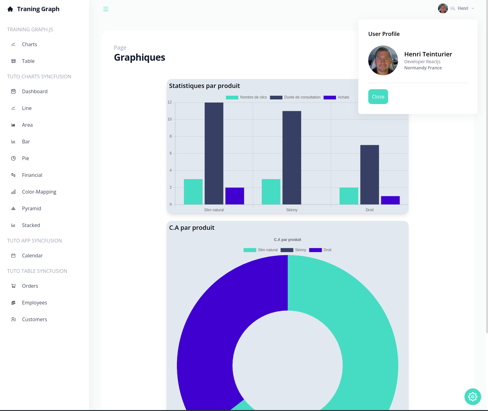

# Entraînement avec GraphJs et syncFusion

Ce "projet" est le résultat d'un petit test technique sur l'utilisation de Graphs.

## Introduction

Ce projet est inspiré d'un tutoriel de JavaScript Mastery sur l'utilisation de SyncFusion qui met à disposition sous forme de composants notamment divers sortes de graphiques.
J'ai adapté complètement le code afin de l'adapter à ce que je souhaitais obtenir.

Je me suis ensuite servi de cette base pour créer de nouvelles pages afin de réaliser des graphiques et un tableau. Cette fois-ci, je suis partie d'une page blanche et j'ai utilisé ChartJs après avoir lu la documentation de cette librairie.

Pourquoi me suis-je appuyé sur ce tutoriel?
Tout d'abord, cela me faisait une bonne introduction à l'utilisation de graphiques puisque je n'en avais jamais fait.  
Ensuite ce tutorial basait son style sur la librairie **Tailwind**. Ne l'ayant jamais utilisé je me suis dit que ce serait une bonne occasion. **Je préfère partir from scratch** pour le style mais je suis agréablement surpris par cette librairie: Des noms de classes très clair et très facilement adaptable. Je préfère tout de même partir from scratch car je trouve que cela rend le code beaucoup plus clair malgré tout (côté HTML).  
Surtout, **ce tutoriel utilisait useContext** que je n'avais jamais utilisé et que je souhaitais découvrir. **Je suis plus à l'aise avec Redux-Store car nous l'avons largement pratiqué pendant ma spécialisation**. J'ai pu constater que le principe reste le même, même si dans cet exemple nous ne l'associons pas à useReducer.

## `déploiement et installation`

Pour installer le projet:

```console
npm install
```

Pour lancer le projet:

```console
npm start
```

adresse de déploiement [www.graphs.henriteinturier.fr](http://www.graphs.henriteinturier.fr/)

## `organisation du projet`

`App.js` est notre page principale. C'est la page qui intègre la majorité de nos routes. (Pour info je n'ai pas créé de page 404).  
`Composants:` Nos Composants sont séparés dans deux dossiers. Les Composants représentants une page complète sont dans le répertoire "pages". Les Composants partiel (SideBar, Header, ...) sont dans le repertoire "components".  
`Data:` Les data se trouvent dans le répertoire data. Dummy.js contient les datas pour les graphs crées avec synFusion. data.js contient les datas fournies pour le test technique.  
`selectors:` Le fichier selectors.js contient les différentes fonctions que j'ai créé pour récupérer les donnes dont on a besoin pour créer les graphiques avec chartJs ainsi que pour le tableau de l'exercice technique.  
`Tests:` Je n'ai pas intégré de tests dans ce petit projet mais nous avons abordé Jest pendant ma formation. J'ai bien conscience que les tests sont très utiles et je compte me former plus profondément sur ces tests prochainement.  
`components/index.jsx pages/Index.jsx` répertorient l'ensemble des composants et pages ce qui permet de les importer plus facilement lorsque c'est nécessaire.

## `Aperçu`

